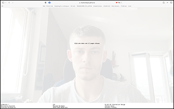
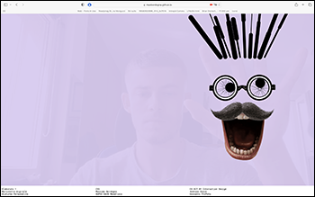

SUPSI 2022-23  
Corso d’interaction design, CV427.01  
Docenti: A. Gysin, G. Profeta  

Elaborato 1: Marionetta digitale  

# Disturbo personalità
Autore: Massimo Bordogna  
[MediaPipe demo-ES6](https://ixd-supsi.github.io/2023/esempi/mp_hands/es6/1_landmarks)


## Introduzione e tema
La consegna consisteva nel progettare un sistema di interfaccia per generare una marionetta in 
realtà aumentata che rappresenti un personaggio reale o inventato  con un proprio carattere. 
Il progetto da me realizzato è stato chiamato “Disturbo Personalità”, una scelta che mira 
a raccontare la caratteristica espressiva della marionetta, lasciando all’utilizzatore finale 
il compito di associarla ad un nome. 
La marionetta  si presenta attraverso due stati: 
lo stato base (pacato), e lo stato alterato (pazzo). La caratteristica formale principale è 
espressa dall’unione di elementi fotografici con elementi generati direttamente attraverso 
il codice. 


## Riferimenti progettuali
Per quanto riguarda la scelta degli elementi che avrebbero formato la marionetta ho preso 
spunto dai celebri “Groucho Glasses”, in riferimento al comico “Groucho Marx”. Pochi elementi 
quindi, ma funzionali allo scopo comunicativo. 

Ho però effettuato delle modifiche rispetto alla maschera originale: ho deciso di togliere 
naso e sopracciglia ed aggiungere capelli e occhi. In particolare occhi e capelli sono stati 
essenziali per aumentare la differenza caratteriale nei due stati emotivi della marionetta.

[]()
<br>
<i>Groucho glasses </i>
<br>


## Design dell’interfraccia e modalià di interazione
All’apertura della pagina uno sfondo bianco tinta unita leggermente trasparente è sovrapposto all'immagine 
registrata dalla webcam del computer. Una scritta centrale informa l'utente sull'azione da effettuare "Alza una mano con il pugno chiuso".
Nel momento in cui una mano chiusa viene inquadrata 
attraverso la webcam, compare la marionetta nel suo stato base. Essa segue i movimenti della mano indirizzando 
gli occhi verso l’esterno del canvas, i capelli hanno uno stato che ne simula la fisicità attraverso peso 
e gravità. Nel momento in cui l’utente apre la mano, la marionetta cambia da stato base a stato 
alterato, che si contraddistingue da una bocca aperta, gli occhiali rotti, i capelli allungati verso l’alto 
(con diversi spessori) e gli occhi rotanti con un bordo seghettato. Inoltre è stato introdotto l’effetto 
sonoro di un urlo che aumenta l’efficacia comunicativa dello stato della marionetta.

[]()[]()[]()
<br>
<i>Stati: base, tranquillo e pazzo </i>
<br>


## Tecnologia usata
Per la simulazione della fisicità dei capelli è stato utilizzato l’esempio sul sito di p5js chiamato “Chain”, 
codice che collega più elementi attraverso la loro posizione imitando una catena e 
determinandone lo stato attraverso una simulazione della gravità e del peso. Questo esempio è 
stato modificato ed implementato all’interno del mio codice ottenendo dei capelli che seguono 
la posizione della mano e che cambiano lunghezza, peso e gravità a dipendenza dello stato (umore) della marionetta.

Il movimento degli occhi nello stato base è ottenuto attraverso la funzione map che mi ha permesso 
di mappare la larghezza e l’altezza del canvas nello spostamento massimo che le pupille possono 
effettuare attorno al keypoint di riferimento.


```JavaScript
//----------------------------------------------------------
//funzione occhi mappati
function pupillaFermaSx(pfSxX, pfSxY) {
	let varX = map (pfSxX, 0, 640, -20, +20)
    let varY = map (pfSxY, 0, 480, -20, +20)

	noStroke()
	fill(0)
	ellipse (pfSxX + varX, pfSxY + varY, 35, 35)
}

//----------------------------------------------------------
//esempio p5js modificato ed utilizzato per i capelli
//il codice realmente utilizzato è eccessivamente lungo per essere inserito
let s1, s2;
let gravity = 9.0;
let mass = 2.0;

function setup() {
  createCanvas(720, 400);
  fill(255, 126);
  // Inputs: x, y, mass, gravity
  s1 = new Spring2D(0.0, width / 2, mass, gravity);
  s2 = new Spring2D(0.0, width / 2, mass, gravity);
}

function draw() {
  background(0);
  s1.update(mouseX, mouseY);
  s1.display(mouseX, mouseY);
  s2.update(s1.x, s1.y);
  s2.display(s1.x, s1.y);
}

function Spring2D(xpos, ypos, m, g) {
  this.x = xpos;// The x- and y-coordinates
  this.y = ypos;
  this.vx = 0; // The x- and y-axis velocities
  this.vy = 0;
  this.mass = m;
  this.gravity = g;
  this.radius = 30;
  this.stiffness = 0.2;
  this.damping = 0.7;

  this.update = function(targetX, targetY) {
    let forceX = (targetX - this.x) * this.stiffness;
    let ax = forceX / this.mass;
    this.vx = this.damping * (this.vx + ax);
    this.x += this.vx;
    let forceY = (targetY - this.y) * this.stiffness;
    forceY += this.gravity;
    let ay = forceY / this.mass;
    this.vy = this.damping * (this.vy + ay);
    this.y += this.vy;
  }

  this.display = function(nx, ny) {
    noStroke();
    ellipse(this.x, this.y, this.radius * 2, this.radius * 2);
    stroke(255);
    line(this.x, this.y, nx, ny);
  }
}
```

## Target e contesto d’uso
Non avendo costruito l’elaborato pensando in anticipo ad un target e ad un contesto specifico è 
difficile individuarne uno perfettamente calzante. Ovviamente andrebbe quindi adeguato al suo utilizzo 
finale, potrei però vedere la marionetta applicata ad un contesto espositivo quale magari una fiera 
o un’esposizione in cui i visitatori possono provare allo stand di riferimento la marionetta. 
Oppure potrebbe essere utilizzata all’interno di un sito web come interazione con l’utente stuzzicandone 
l’interesse e creando un legame di interazione attiva.

